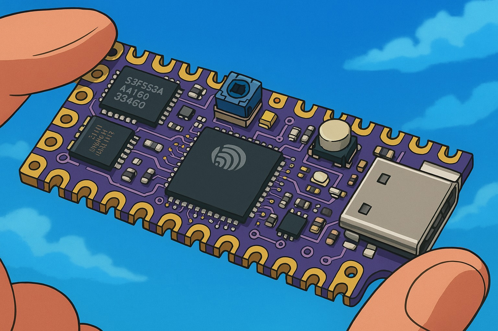
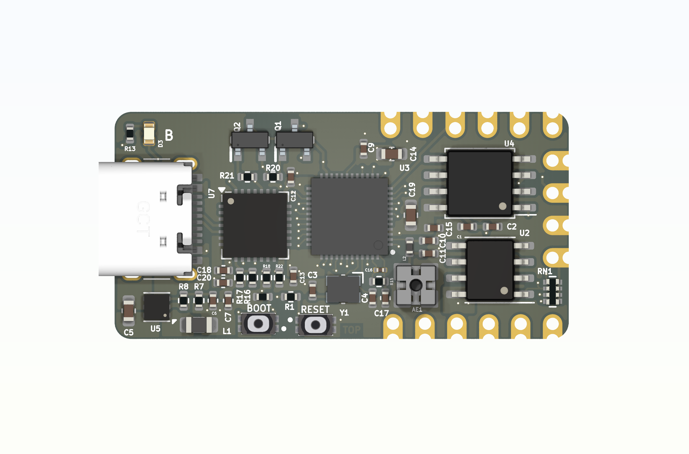

# ESP32-REACTJS-DEVKIT

## 📖 Description
**ESP32-REACTJS-DEVKIT** is an ultra-compact board based on **ESP32-D0WDQ6** with **16MB of Flash RAM**, designed for **robotics, IoT, and wearable** applications. Thanks to its small size and the power of the ESP32, it is ideal for advanced projects requiring wireless connectivity and high computational performance.

### 📏 Dimensions
- **Width:** 35mm  
- **Height:** 18mm  
- **Thickness:** 1mm  

## ⭐ Main Features
- **Microcontroller:** ESP32-D0WDQ6
- **Flash Memory:** 16MB
- **Wi-Fi & Bluetooth:** Dual-mode Wi-Fi and Bluetooth 4.2 BLE
- **Ultra-compact size**, ideal for embedded projects
- **High performance** for advanced applications
- **Support for ESP-IDF and Arduino Framework**

## 🔧 Applications
- **🤖 Robotic Projects**: Motor control, sensors, and actuators with remote connectivity
- **🌐 IoT (Internet of Things)**: Smart home, industrial automation, environmental monitoring
- **⌚ Wearable Devices**: Fitness, health, and human interaction devices

---
## Preview

---

## 🛠️ Requirements
- **Software**:
  - ESP-IDF (Espressif IoT Development Framework)
  - Arduino IDE (optional)
  - ReactJS for the frontend management interfaces
- **Hardware**:
  - ESP32-REACTJS-DEVKIT
  - Connection cables
  - Optional sensors and actuators

## 🏗️ Installation
### 1. 🖥️ Development Environment Setup
A **boilerplate** will soon be available to seamlessly integrate with the board. Stay tuned for updates!

### 2. 🌍 ReactJS Frontend Setup
A **dedicated boilerplate** for the ReactJS frontend is in development and will be released soon to simplify integration with the board.

## 🤝 Contributions
If you wish to contribute to the project, feel free to submit a Pull Request or report any issues in the Issues section.

## 📜 License
This project is released under the **MIT** license. You are free to use it with the obligation to credit the original authors.

---

Thank you for choosing **ESP32-REACTJS-DEVKIT**! 🚀

